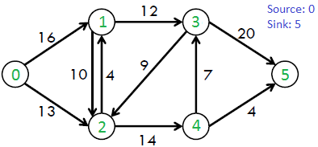
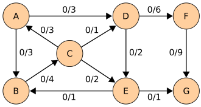
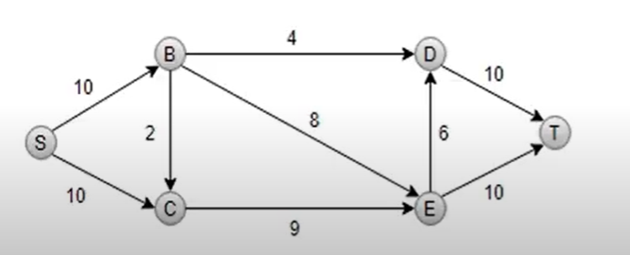
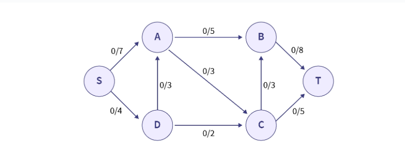

# Ford-Fulkerson Algorithm - Problem Solutions

| Problem | Solution (Max Flow) | Visualization | Remarks |
|---------|----------------------|---------------|---------|
| **1**   | **23**               |  | Initial graph with augmenting paths. |
| **2**   | *(Pending)*          |  | Needs further analysis. |
| **3**   | **19**               |  | Complex network with bottlenecks. |
| **4**   | **10**               |  | Minimal residual capacities. |
