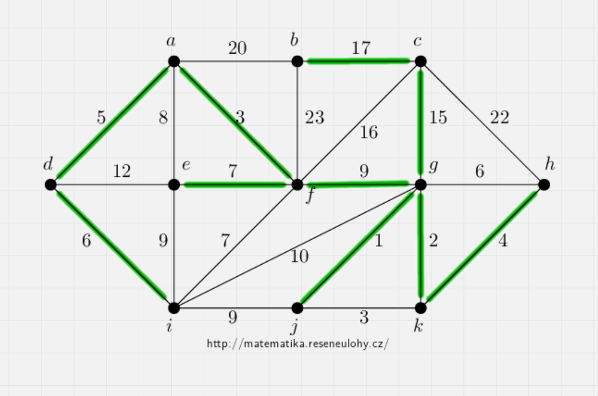

# Minimum Spanning Tree Solutions

## Problem 1

| Problem | Solution |
|---------|----------|
|  |  |

## Problem 2 

| Problem | Solution |
|---------|----------|
|  |  |

## Problem 3

| Problem | Solution |
|---------|----------|
|  | *(Solution coming soon)* |

---

### Key:
- **Blue nodes**: Graph vertices
- **Black lines**: Possible edges with weights
- **Red lines**: Edges selected in MST
- **Dotted lines**: Rejected edges
